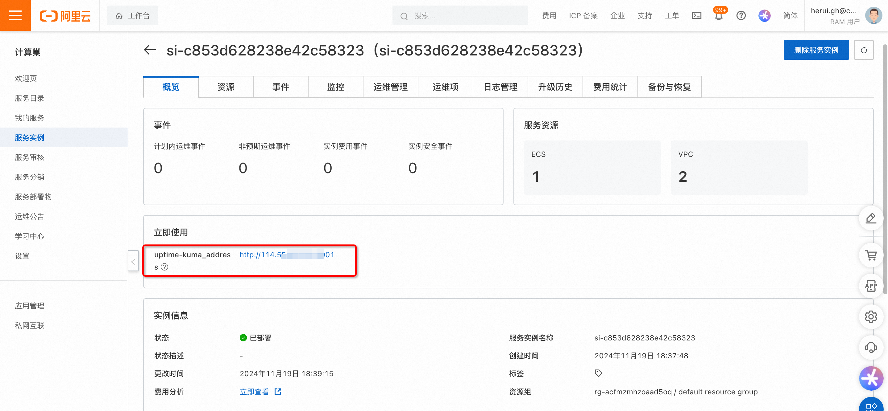
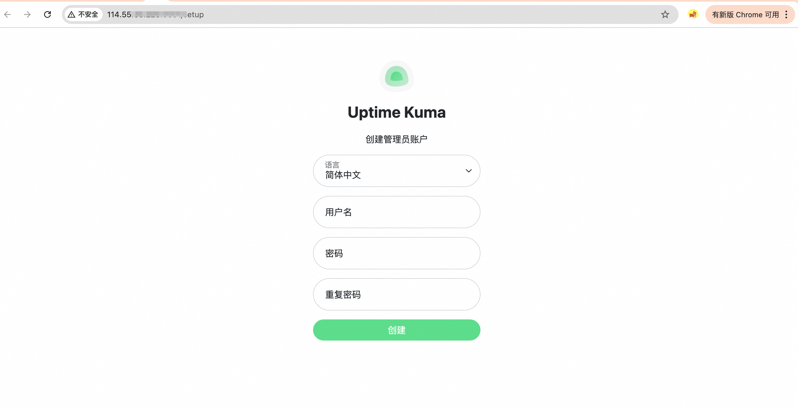
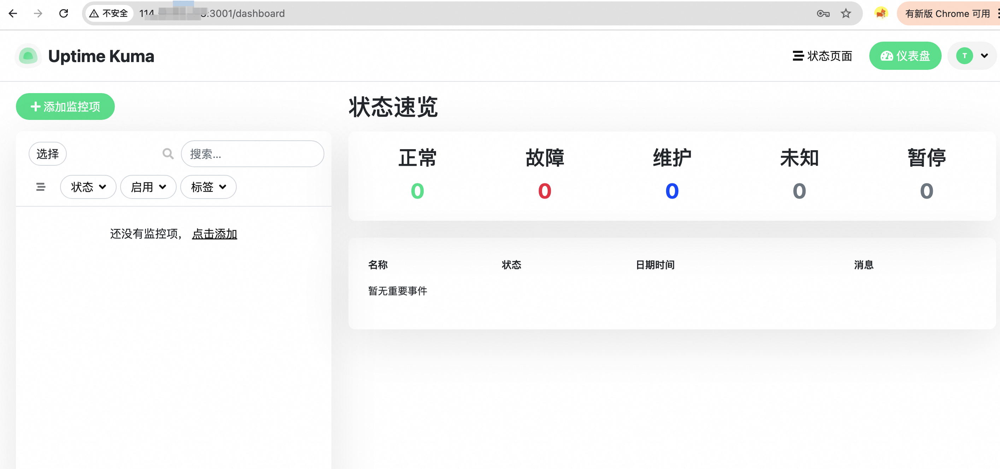

# Demo服务实例部署文档

## 概述

Uptime Kuma 是一款开源自托管的轻量级监控工具，拥有简洁美观的界面和丰富的告警方式。提供实时的状态监控和通知提醒功能，可监测网站，数据库，Docker容器，Steam游戏服务器等，
且支持通过 Telegram、Discord、Gotify、Slack、Pushover、Email (SMTP) 等多种服务发送通知消息，以便及时接收网站服务故障通知，帮助用户减少经济损失。非常适合小中型项目的网站和个人网站使用。
Uptime Kuma具有灵活高效的用户交互界面，用户可以根据需要隐藏或显示监控状态，并且可以使用网页标签功能对不同功能的网站进行分类，以便在特定时段关注高风险站点。此外，Uptime Kuma还提供多种语言支持。
本文将介绍通过计算巢如何快速安装部署Uptime Kuma。

## 计费说明

Uptime Kuma 在计算巢上的费用主要涉及：

所选vCPU与内存规格 磁盘容量 公网带宽 计费方式包括：

- 按量付费（小时）
- 包年包月 预估费用在创建实例时可实时看到。

预估费用在创建实例时可实时看到。

## 部署架构

Uptime Kuma社区版是单机部署架构, 基于 Docker Compose进行独立部署.

## RAM账号所需权限

Uptime Kuma服务需要对ECS、VPC等资源进行访问和创建操作，若您使用RAM用户创建服务实例，需要在创建服务实例前，对使用的RAM用户的账号添加相应资源的权限。添加RAM权限的详细操作，请参见为RAM用户授权 。所需权限如下表所示。

| 权限策略名称                          | 备注                         |
|---------------------------------|----------------------------|
| AliyunECSFullAccess             | 管理云服务器服务（ECS）的权限           |
| AliyunVPCFullAccess             | 管理专有网络（VPC）的权限             |
| AliyunROSFullAccess             | 管理资源编排服务（ROS）的权限           |
| AliyunComputeNestUserFullAccess | 管理计算巢服务（ComputeNest）的用户侧权限 |
| AliyunCloudMonitorFullAccess    | 管理云监控（CloudMonitor）的权限     |

## 部署流程

### 部署步骤
1. 单击[部署链接](https://computenest.console.aliyun.com/service/instance/create/default?type=user&ServiceName=Uptime Kuma 社区版)，进入服务实例部署界面。
2. 根据界面提示，填写参数完成部署。
   选择资源类型并配置ECS实例密码.
   
   最后配置可用区，可选择新建VPC，也可使用已有的VPC.
   
3. 设置完参数后，点击下一步确认订单，点击立即创建，等待服务实例创建完成。
4. 服务实例创建成功后，进入服务实例详情页。在概览页可获取Uptime Kuma的登录信息。
   
### 验证结果

点击链接可进入Uptime Kuma的控制台，根据提示创建管理员账户之后即可开始使用。

    <footer>
        
查看更多计算巢服务(https://computenest.aliyun.com)

    </footer>

